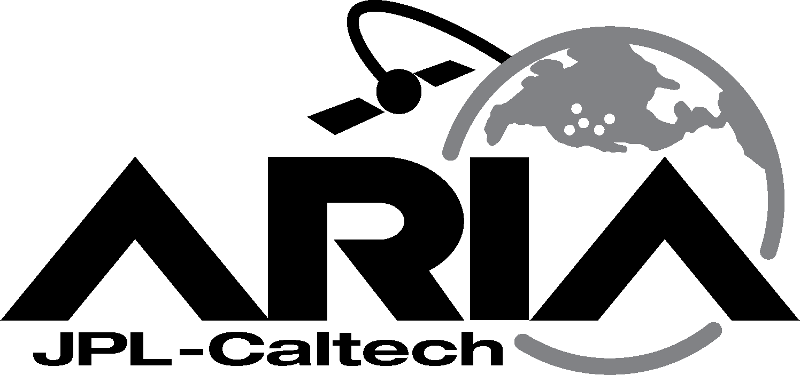

# HySDS - ARIA - Azure scripts

> Scripts to make your life easier when deploying HySDS and ARIA on Microsoft Azure cloud

This repository complements the official [HySDS](https://github.com/hysds) repos developed by JPL.

## Directories

### `terraform/` - Terraform version of the deployment scripts

This directory contains `.tf` files written in the HashiCorp configuration language (HCL) that describes a HySDS cluster. For more information on how to use it, refer to [the README file in the directory](terraform/README.md)

### `shell/` - Standard UNIX shell version of the deployment scripts

**NOTE: the shell version is currently deprecated!**

The shell script version are written in standard `sh` shell and provides a semi-automated way of deploying a HySDS cluster. The rationale for making shell scripts instead of a more powerful tool in an interpreted language like Python is twofold: to reduce code needed and to improve cross-platform compatibility. Occasionally however, Python helpers are written for more advanced functionality such as JSON parsing.

### `helpers/` - Helper scripts for the ARIA adaptation

Shell scripts meant to make life easier for the user. Further documentation is provided in another README.md file in that directory.

### `docs/` - Documentation

Miscellaneous documentation written in Markdown for resolving common problems you may encounter with the system, as well as operational guides.

Currenty available documentation:

- [Fix slow Docker images on Factotum](docs/fix_slow_docker.md)

## Usage

Please refer to the README files inside the directories for detailed usage during the installation

### Post deployment

Further configuration is still required after you run either the Terraform or the shell versions of the deployment scripts. Some of the tasks that you need to do includes:

1. Set up CI by navigating to `http://[CI_FQDN]:8080` and proceed as admin, and retrieve Jenkin's API key and the current administrative user's username. Optionally, you might want to update Jenkins before setting it up by downloading the [latest Jenkins `.war` file](http://mirrors.jenkins.io/war-stable/latest/jenkins.war) and replacing the old version in `/usr/local/bin/jenkins.war`.
2. `sds configure` to set up the environment constants used by HySDS on Mozart, one of which is to add `JENKINS_API_KEY` as retrieved previously.
3. Verify that ElasticSearch is running on Mozart, Metrics and GRQ instances by running `$ systemctl status elasticsearch` on those instances. If it's not up, run `# systemctl start elasticsearch`.
4. `sds update all -f` to update all components of HySDS.
5. `sds start all -f` to start all components of HySDS, and use `sds status all` to verify that all components are up and running.
6. (Highly recommended) Improve Docker performance on Factotum by using [this guide](docs/fix_slow_docker.md).
7. (Optional) Set up real HTTPS certificates instead of using self-signed ones by running `sh /home/ops/https_autoconfig.sh` on the servers that need it (mainly Mozart, GRQ and Metrics). The current script only supports DNS verification through CloudFlare.
8. (Optional) Set up the ARIA adaptation using instructions from [here](https://github.com/hysds/ariamh/wiki/ARIA-Adaptation).

## Good to knows/Caveats

- Make sure that Azure is properly configured with `Microsoft.Network`, `Microsoft.Compute` and `Microsoft.Storage` resource providers all enabled
- Triple check the environment variables defined in the `envvars.sh` file before deploying, such as the name of the resource group, the names of the resources to be created etc.
- The scripts are not meant to be run multiple times. It is best to run them only once
- Always perform all tasks on a strong and reliable connection to avoid any potential failures requiring the scripts to be restarted
- The user is required to manually copy and paste certain values from their system or display into the script when necessary. This is to reduce the complexity of the script. Certain more advanced features like JSON parsing is done via piping data into Python
- You may need to switch account subscriptions within your Azure CLI tool using the command `azure account set -s [subscription ID]`
- These scripts use Python's built-in `json` library to process JSON emitted by the `az` tool. The script automatically detects the Python version present on the system
- All SSH/SCP commands are run with `-o StrictHostKeyChecking=no` to skip having to answer `yes` when connecting to the VMs for the first time

## Known issues

### Phase 2 fails with `No module named 'azure.mgmt.compute'` during creation of VM on macOS

This is caused by a faulty version of the `az` tool (namely 2.0.47) installed by Homebrew (if you used Homebrew to install the package). You have to downgrade the tool to 2.0.46 manually with the following commands. This assumes you already have the `az` tool installed.

`$ brew unlink azure-cli`

`$ brew install https://raw.githubusercontent.com/Homebrew/homebrew-core/3894a0d2095f48136ce1af5ebd5ba42dd38f1dac/Formula/azure-cli.rb`

### `yum -y update` hangs during Phase 2

Symptoms: During the provisioning of the base VM in phase 2, a `yum -y update` command causes the base VM to be unresponsive. There may also be a `ssh_exchange_identification: read: Connection reset by peer` message returned if one attempts to SSH into the VM.

Reason: The `yum -y update` command is CPU intensive, and for some reason, the deprovisioning commands is run in parallel with the package updater, causing the user to be unable to SSH back into the machine.

Solution: The `yum -y update` command has been moved from phase 2 to phase 4. The deprovisioning commands is explicitly run on another SSH session right after the installation of necessary yum packages.

## Contributing

If you encounter any issues with the script, please do not hesitate to open an issue on this repo.
